ABM_Rmarkdown
================

## Agent-based model

This is an R Markdown format used for publishing markdown documents to
GitHub. When you click the **Knit** button all R code chunks are run and
a markdown file (.md) suitable for publishing to GitHub is generated.

## Executing ABM

## Including Plots

You can also embed plots, for example:

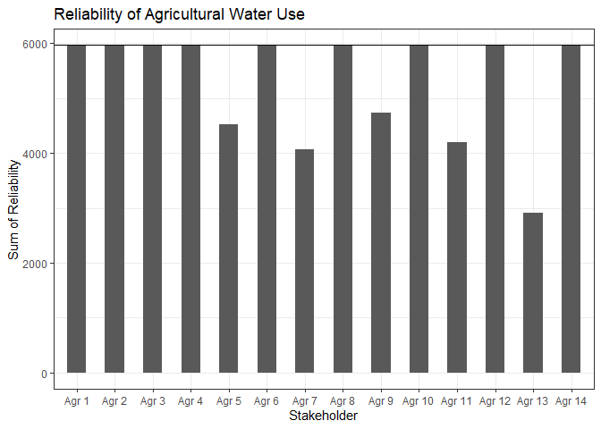<!-- -->

Note that the `echo = FALSE` parameter was added to the code chunk to
prevent printing of the R code that generated the plot.

``` r
# --- column labels 먼저 정의! ---
col_labels <- c("Intake", "Agr", "Power")

rows <- c(with_ABM_new_diversion$breaker$first_row,
          with_ABM_new_diversion$breaker$second_row,
          with_ABM_new_diversion$breaker$third_row)

cols <- c(with_ABM_new_diversion$breaker$first_col,
          with_ABM_new_diversion$breaker$second_col,
          with_ABM_new_diversion$breaker$third_col)

# --- NA 제거 + 범위 밖 값 제거(중요) ---
valid <- !is.na(rows) & !is.na(cols) &
         rows >= 1 & rows <= 14 &
         cols >= 1 & cols <= 3

rows <- rows[valid]
cols <- cols[valid]

# --- count matrix ---
heat_matrix <- matrix(0, nrow = 14, ncol = 3)

for (k in seq_along(rows)) {
  r <- rows[k]
  c <- cols[k]
  heat_matrix[r, c] <- heat_matrix[r, c] + 1
}

df_heat <- melt(heat_matrix)
colnames(df_heat) <- c("row", "col", "count")

# --- labels / factors for plotting ---
df_heat <- df_heat %>%
  mutate(
    row_f = factor(row, levels = 14:1),                 # show 14 at top
    col_f = factor(col, levels = 1:3, labels = col_labels),
    label = ifelse(count == 0, "", as.character(count)),
    count_plot = ifelse(count == 0, NA, count)          # optional: hide 0 tiles
  )

ggplot(df_heat, aes(x = col_f, y = row_f, fill = count_plot)) +
  geom_tile(color = "black", linewidth = 0.3) +
  geom_text(aes(label = label), size = 3) +
  scale_x_discrete(position = "top") +
  scale_y_discrete(breaks = factor(14:1), labels = 14:1) +
  scale_fill_gradient(
    low  = "white",
    high = "red",
    name = "Number of\nABM triggers",
    na.value = "white"
  ) +
  labs(x = NULL, y = NULL) +
  theme_minimal(base_size = 12) +
  theme(
    axis.ticks = element_blank(),
    panel.grid = element_blank(),
    axis.text.x.top = element_text(size = 12),
    axis.text.y = element_text(size = 10),
    legend.position = "right"
  )
```

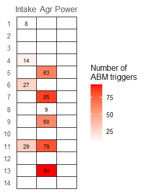<!-- -->

# Cumulative plots

``` r
DF <- data.frame(Intake = 1:12, 
                 with_ABM = with_ABM_new_diversion$Table_intake[,2], 
                 without_ABM =  without_ABM_new_diversion$Table_intake[,2])
DFlong <- DF |> pivot_longer(cols = -Intake,names_to = "ABM")

ggplot(DFlong,aes(x=Intake, y = value,fill= ABM)) + 
  geom_col(position="dodge") +
  theme_bw() +ylab("Days of Water Supply Availability")+
  ggtitle("취수장의 용수공급가능일수") +
  scale_y_continuous(expand = expansion(mult = c(0, 0.05)), limits = NULL) +
  coord_cartesian(ylim = c(1500, NA))
```

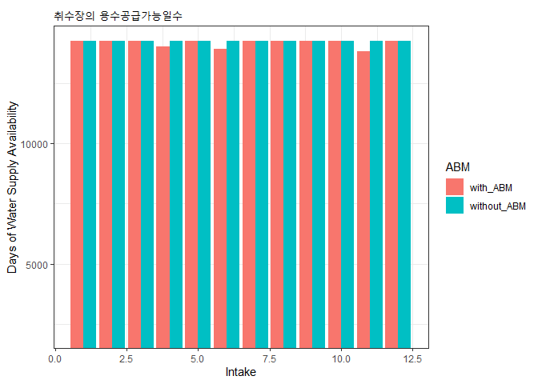<!-- -->

``` r
DF <- data.frame(Agr = 1:14, 
                 with_ABM = with_ABM_new_diversion$Table_agr[,2], 
                 without_ABM =  without_ABM_new_diversion$Table_agr[,2])
DFlong <- DF |> pivot_longer(cols = -Agr,names_to = "ABM")

ggplot(DFlong,aes(x=Agr, y = value,fill= ABM)) + 
  geom_col(position="dodge") +
  theme_bw() +ylab("Days of Water Supply Availability")+
  ggtitle("Cumulative Reliability")+
  scale_y_continuous(expand = expansion(mult = c(0, 0.05)), limits = NULL) +
  coord_cartesian(ylim = c(500, NA))
```

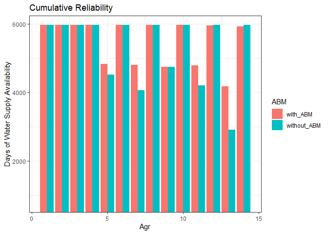<!-- -->

``` r
DF <- data.frame(Power = 1:3, 
                 with_ABM = with_ABM_new_diversion$Table_power[,2], 
                 without_ABM =  without_ABM_new_diversion$Table_power[,2])
DFlong <- DF |> pivot_longer(cols = -Power,names_to = "ABM")

ggplot(DFlong,aes(x=Power, y = value,fill= ABM)) + 
  geom_col(position="dodge") +
  theme_bw() +ylab("Days of Water Supply Availability")+
  ggtitle("발전용수의 용수공급가능일수")
```

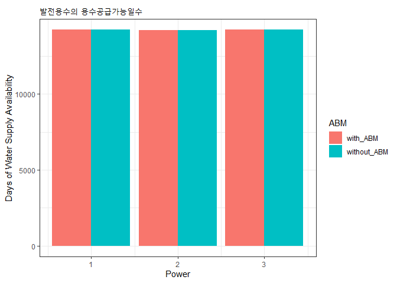<!-- -->

# Drought cases

``` r
# Drought case 1: 1994 - 1997 ------------------------------------------------------------------

ggplot(out$series, aes(x = Time, y = deficit)) +
  geom_line(color = "red") +
  geom_hline(aes(yintercept = 0), linetype = "dashed") +
  
  # 🔶 1994–1997 강조 박스
  annotate("rect",
           xmin = as.Date("1994-01-01"),
           xmax = as.Date("1997-12-31"),
           ymin = -Inf,
           ymax = Inf,
           alpha = 0.5,          # 투명도
           fill = "grey") +
  
  # 🔶 2014–2017 강조 박스
  annotate("rect",
           xmin = as.Date("2014-01-01"),
           xmax = as.Date("2017-12-31"),
           ymin = -Inf,
           ymax = Inf,
           alpha = 0.5,
           fill = "grey") +
  
  labs(#title = "Drought Deficit Over Time",
       y = "Deficit (MCM)",
       x = "Time") +
  
  scale_x_date(
    date_breaks = "1 year",
    date_labels = "%Y"
  ) +
  
  theme_bw() +
  theme(
    axis.text.x = element_text(angle = 90, vjust = 0.5)
  )
```

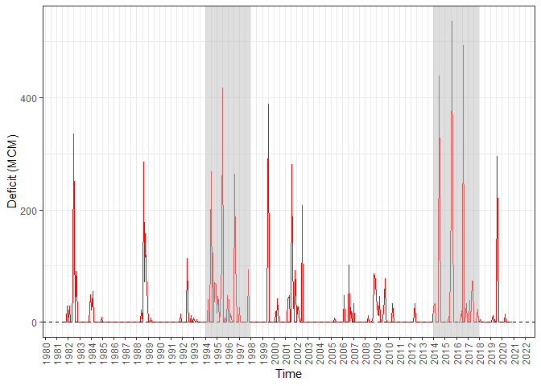<!-- -->

# Result

``` r
start_date <- as.Date("1981-10-01")
n_days <- nrow(with_ABM_new_diversion$df_intake)

date_seq <- seq(start_date, by = "day", length.out = n_days)
```

# Agr 5

``` r
ts_df <- data.frame(
  Date = date_seq,
  Intake4_withABM    = with_ABM_new_diversion$df_intake[, 4],
  Intake4_withoutABM = without_ABM_new_diversion$df_intake[,4],
  Agr5_withABM       = with_ABM_new_diversion$df_agr[, 5],
  Agr5_withoutABM    = without_ABM_new_diversion$df_agr[,5],
  Intake5_withABM       = with_ABM_new_diversion$df_intake[,5],
  Intake5_withoutABM    = without_ABM_new_diversion$df_intake[,5]
)

# long-format으로 변환 (Stakeholder × Scenario)
ts_long <- ts_df |>
  pivot_longer(
    cols = -Date,
    names_to   = c("Stakeholder", "Scenario"),
    names_pattern = "(.*)_(withABM|withoutABM)",
    values_to  = "value"
  ) |>
  mutate(
    Stakeholder = factor(Stakeholder,
                         levels = c("Intake4", "Agr5", "Intake5"),
                         labels = c("Intake 4 (tributary donor)", "Agr 5 (recipient)", "Intake 5 (main donor)")),
    Scenario = factor(Scenario,
                      levels = c("withoutABM", "withABM"),
                      labels = c("Without ABM", "With ABM"))
  )


## ===== 1. Drought Case 1 (1994–1997) =====

drought1_long <- ts_long |>
  filter(
    Date >= as.Date("1994-01-01"),
    Date <= as.Date("1997-12-31")
  )

gg_drought1_ABM <- ggplot(drought1_long,
                          aes(x = Date, y = value, color = Scenario, linetype = Scenario)) +
  geom_line(linewidth = 0.5) +
  facet_wrap(~ Stakeholder, ncol = 1, scales = "free_y") +
  scale_color_manual(values = c("Without ABM" = "grey40",
                                "With ABM"    = "red")) +
  labs(
    title = "Drought Case 1 (1994–1997): ABM Effects on Water Supply",
    x = "Time",
    y = "Daily Supplied Water (MCM)"
  ) +
  theme_bw() +
  theme(
    strip.background = element_rect(fill = "white"),
    strip.text = element_text(face = "bold"),
    legend.position = "top",
    axis.text.x = element_text( vjust = 0.5)
  )

gg_drought1_ABM
```

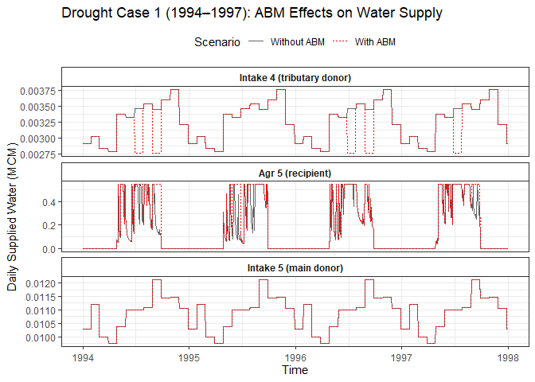<!-- -->

``` r
drought2_long <- ts_long |>
  filter(
    Date >= as.Date("2014-01-01"),
    Date <= as.Date("2017-12-31")
  )

gg_drought2_ABM <- ggplot(drought2_long,
                          aes(x = Date, y = value, color = Scenario, linetype = Scenario)) +
  geom_line(linewidth = 0.5) +
  facet_wrap(~ Stakeholder, ncol = 1, scales = "free_y") +
  scale_color_manual(values = c("Without ABM" = "grey40",
                                "With ABM"    = "red")) +
  labs(
    title = "Drought Case 2 (2014–2017): ABM Effects on Water Supply",
    x = "Time",
    y = "Daily Supplied Water (MCM)"
  ) +
  theme_bw() +
  theme(
    strip.background = element_rect(fill = "white"),
    strip.text = element_text(face = "bold"),
    legend.position = "top",
    axis.text.x = element_text(angle = 90, vjust = 0.5)
  )

gg_drought2_ABM
```

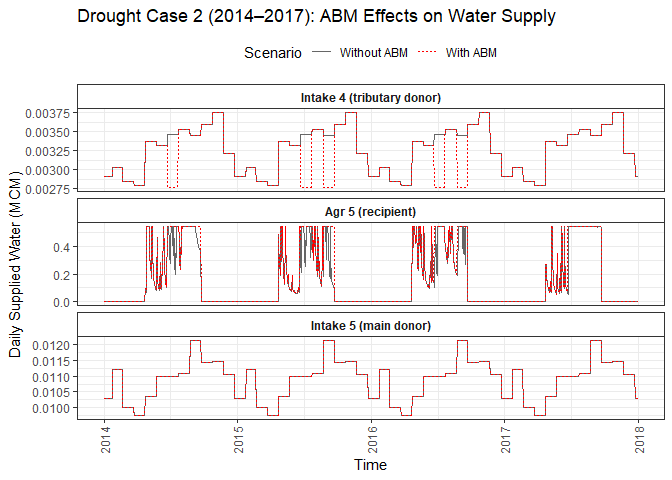<!-- -->

# Agr 11

``` r
ts_df <- data.frame(
  Date = date_seq,
  Intake11_withABM    = with_ABM_new_diversion$df_intake[, 11],
  Intake11_withoutABM = without_ABM_new_diversion$df_intake[, 11],
  Agr11_withABM       = with_ABM_new_diversion$df_agr[, 11],
  Agr11_withoutABM    = without_ABM_new_diversion$df_agr[, 11],
  Agr12_withABM       = with_ABM_new_diversion$df_agr[, 12],
  Agr12_withoutABM    = without_ABM_new_diversion$df_agr[, 12]
)

# long-format으로 변환 (Stakeholder × Scenario)
ts_long <- ts_df |>
  pivot_longer(
    cols = -Date,
    names_to   = c("Stakeholder", "Scenario"),
    names_pattern = "(.*)_(withABM|withoutABM)",
    values_to  = "value"
  ) |>
  mutate(
    Stakeholder = factor(Stakeholder,
                         levels = c("Intake11", "Agr11", "Agr12"),
                         labels = c("Intake 11 (tributary donor)", "Agr 11 (recipient)", "Agr 12 (main donor)")),
    Scenario = factor(Scenario,
                      levels = c("withoutABM", "withABM"),
                      labels = c("Without ABM", "With ABM"))
  )


## ===== 1. Drought Case 1 (1994–1997) =====

drought1_long <- ts_long |>
  filter(
    Date >= as.Date("1994-01-01"),
    Date <= as.Date("1997-12-31")
  )

gg_drought1_ABM <- ggplot(drought1_long,
                          aes(x = Date, y = value, color = Scenario, linetype = Scenario)) +
  geom_line(linewidth = 0.5) +
  facet_wrap(~ Stakeholder, ncol = 1, scales = "free_y") +
  scale_color_manual(values = c("Without ABM" = "grey40",
                                "With ABM"    = "red")) +
  labs(
    title = "Drought Case 1 (1994–1997): ABM Effects on Water Supply",
    x = "Time",
    y = "Daily Supplied Water (MCM)"
  ) +
  theme_bw() +
  theme(
    strip.background = element_rect(fill = "white"),
    strip.text = element_text(face = "bold"),
    legend.position = "top",
    axis.text.x = element_text( vjust = 0.5)
  )

gg_drought1_ABM
```

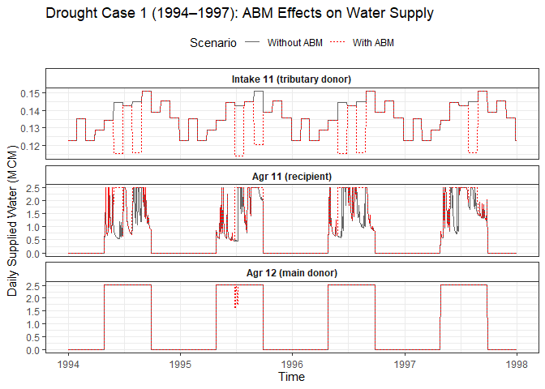<!-- -->

``` r
## ===== 2. Drought Case 2 (2014–2017) =====

drought2_long <- ts_long |>
  filter(
    Date >= as.Date("2014-01-01"),
    Date <= as.Date("2017-12-31")
  )

gg_drought2_ABM <- ggplot(drought2_long,
                          aes(x = Date, y = value, color = Scenario, linetype = Scenario)) +
  geom_line(linewidth = 0.5) +
  facet_wrap(~ Stakeholder, ncol = 1, scales = "free_y") +
  scale_color_manual(values = c("Without ABM" = "grey40",
                                "With ABM"    = "red")) +
  labs(
    title = "Drought Case 2 (2014–2017): ABM Effects on Water Supply",
    x = "Time",
    y = "Daily Supplied Water (MCM)"
  ) +
  theme_bw() +
  theme(
    strip.background = element_rect(fill = "white"),
    strip.text = element_text(face = "bold"),
    legend.position = "top",
    axis.text.x = element_text(angle = 90, vjust = 0.5)
  )

gg_drought2_ABM
```

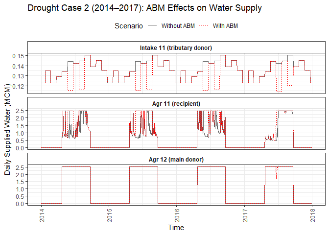<!-- -->

# Result: Agr 13

``` r
ts_df <- data.frame(
  Date = date_seq,
  Agr13_withABM       = with_ABM_new_diversion$df_agr[, 13],
  Agr13_withoutABM    = without_ABM_new_diversion$df_agr[, 13],
  Agr14_withABM       = with_ABM_new_diversion$df_agr[, 14],
  Agr14_withoutABM    = without_ABM_new_diversion$df_agr[, 14]
)


# long-format으로 변환 (Stakeholder × Scenario)
ts_long <- ts_df |>
  pivot_longer(
    cols = -Date,
    names_to   = c("Stakeholder", "Scenario"),
    names_pattern = "(.*)_(withABM|withoutABM)",
    values_to  = "value"
  ) |>
  mutate(
    Stakeholder = factor(Stakeholder,
                         levels = c("Agr13", "Agr14"),
                         labels = c("Agr 13 (recipient)", "Agr 14 (main donor)")),
    Scenario = factor(Scenario,
                      levels = c("withoutABM", "withABM"),
                      labels = c("Without ABM", "With ABM"))
  )


## ===== 1. Drought Case 1 (1994–1997) =====

drought1_long <- ts_long |>
  filter(
    Date >= as.Date("1994-01-01"),
    Date <= as.Date("1997-12-31")
  )

gg_drought1_ABM <- ggplot(drought1_long,
                          aes(x = Date, y = value, color = Scenario, linetype = Scenario)) +
  geom_line(linewidth = 0.5) +
  facet_wrap(~ Stakeholder, ncol = 1, scales = "free_y") +
  scale_color_manual(values = c("Without ABM" = "grey40",
                                "With ABM"    = "red")) +
  labs(
    title = "Drought Case 1 (1994–1997): ABM Effects on Water Supply",
    x = "Time",
    y = "Daily Supplied Water (MCM)"
  ) +
  theme_bw() +
  theme(
    strip.background = element_rect(fill = "white"),
    strip.text = element_text(face = "bold"),
    legend.position = "top",
    axis.text.x = element_text(angle = 90, vjust = 0.5)
  )

gg_drought1_ABM
```

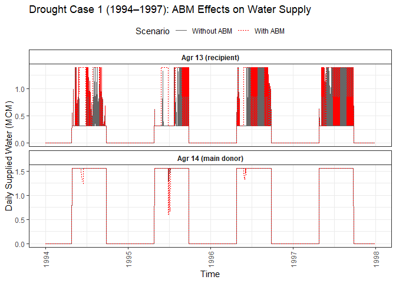<!-- -->

``` r
## ===== 2. Drought Case 2 (2014–2017) =====

drought2_long <- ts_long |>
  filter(
    Date >= as.Date("2014-01-01"),
    Date <= as.Date("2017-12-31")
  )

gg_drought2_ABM <- ggplot(drought2_long,
                          aes(x = Date, y = value, color = Scenario, linetype = Scenario)) +
  geom_line(linewidth = 0.5) +
  facet_wrap(~ Stakeholder, ncol = 1, scales = "free_y") +
  scale_color_manual(values = c("Without ABM" = "grey40",
                                "With ABM"    = "red")) +
  labs(
    title = "Drought Case 2 (2014–2017): ABM Effects on Water Supply",
    x = "Time",
    y = "Daily Supplied Water (MCM)"
  ) +
  theme_bw() +
  theme(
    strip.background = element_rect(fill = "white"),
    strip.text = element_text(face = "bold"),
    legend.position = "top",
    axis.text.x = element_text(angle = 90, vjust = 0.5)
  )

gg_drought2_ABM
```

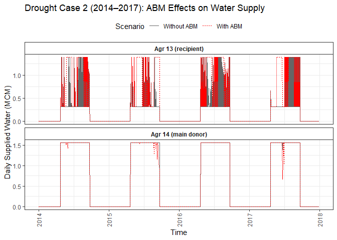<!-- -->

# Result: Agr 7

``` r
ts_df <- data.frame(
  Date = date_seq,
  Intake6_withABM    = with_ABM_new_diversion$df_intake[, 6],
  Intake6_withoutABM = without_ABM_new_diversion$df_intake[, 6],
  Agr7_withABM       = with_ABM_new_diversion$df_agr[, 7],
  Agr7_withoutABM    = without_ABM_new_diversion$df_agr[, 7],
  Intake7_withABM       = with_ABM_new_diversion$df_intake[, 7],
  Intake7_withoutABM    = without_ABM_new_diversion$df_intake[, 7]
)


# long-format으로 변환 (Stakeholder × Scenario)
ts_long <- ts_df |>
  pivot_longer(
    cols = -Date,
    names_to   = c("Stakeholder", "Scenario"),
    names_pattern = "(.*)_(withABM|withoutABM)",
    values_to  = "value"
  ) |>
  mutate(
    Stakeholder = factor(Stakeholder,
                         levels = c("Intake6", "Agr7", "Intake7"),
                         labels = c("Intake 6 (tributary donor)", "Agr 7 (recipient)", "Intake 7 (main donor)")),
    Scenario = factor(Scenario,
                      levels = c("withoutABM", "withABM"),
                      labels = c("Without ABM", "With ABM"))
  )


## ===== 1. Drought Case 1 (1994–1997) =====

drought1_long <- ts_long |>
  filter(
    Date >= as.Date("1994-01-01"),
    Date <= as.Date("1997-12-31")
  )

gg_drought1_ABM <- ggplot(drought1_long,
                          aes(x = Date, y = value, color = Scenario, linetype = Scenario)) +
  geom_line(linewidth = 0.5) +
  facet_wrap(~ Stakeholder, ncol = 1, scales = "free_y") +
  scale_color_manual(values = c("Without ABM" = "grey40",
                                "With ABM"    = "red")) +
  labs(
    title = "Drought Case 1 (1994–1997): ABM Effects on Water Supply",
    x = "Time",
    y = "Daily Supplied Water (MCM)"
  ) +
  theme_bw() +
  theme(
    strip.background = element_rect(fill = "white"),
    strip.text = element_text(face = "bold"),
    legend.position = "top",
    axis.text.x = element_text(angle = 90, vjust = 0.5)
  )

gg_drought1_ABM
```

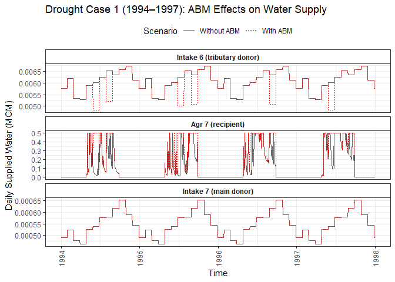<!-- -->

``` r
## ===== 2. Drought Case 2 (2014–2017) =====

drought2_long <- ts_long |>
  filter(
    Date >= as.Date("2014-01-01"),
    Date <= as.Date("2017-12-31")
  )

gg_drought2_ABM <- ggplot(drought2_long,
                          aes(x = Date, y = value, color = Scenario, linetype = Scenario)) +
  geom_line(linewidth = 0.5) +
  facet_wrap(~ Stakeholder, ncol = 1, scales = "free_y") +
  scale_color_manual(values = c("Without ABM" = "grey40",
                                "With ABM"    = "red")) +
  labs(
    title = "Drought Case 2 (2014–2017): ABM Effects on Water Supply",
    x = "Time",
    y = "Daily Supplied Water (MCM)"
  ) +
  theme_bw() +
  theme(
    #text = element_text(family = "Helvetica"),
    strip.background = element_rect(fill = "white"),
    strip.text = element_text(face = "bold"),
    legend.position = "top",
    axis.text.x = element_text(angle = 90, vjust = 0.5)
  )

gg_drought2_ABM
```

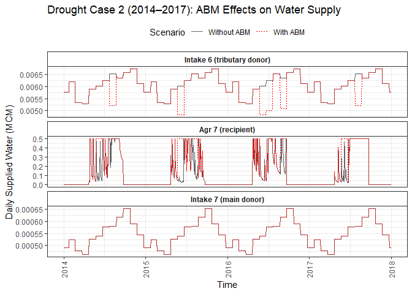<!-- -->

# Cumulative lines

## recipients

``` r
cumline <- data.frame(days = 1:c(39*365), cumsum_withoutABM= cumsum(without_ABM_new_diversion$df_agr[,5]),cumsum_withABM= cumsum(with_ABM_new_diversion$df_agr[,5]))
ggplot(data = cumline, aes(x = days)) +
  geom_line(aes(y = cumsum_withoutABM, color = "Without ABM")) +
  geom_line(aes(y = cumsum_withABM, color = "With ABM")) +
  scale_color_manual(
    values = c("Without ABM" = "blue", "With ABM" = "red"),
    name = "Scenario"  # 범례 제목
  ) +
  labs(
    title = "Cumulative Intake Comparison for Agr 5",
    x = "Days",
    y = "Cumulative Intake (MCM)"
  ) +
  theme_classic()
```

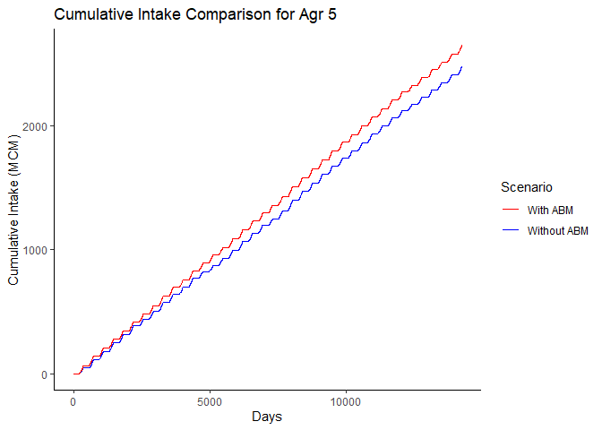<!-- -->

``` r
## Intake 11
cumline <- data.frame(days = 1:c(39*365), cumsum_withoutABM= cumsum(without_ABM_new_diversion$df_intake[,11]),cumsum_withABM= cumsum(with_ABM_new_diversion$df_intake[,11]))
ggplot(data = cumline, aes(x = days)) +
  geom_line(aes(y = cumsum_withoutABM, color = "Without ABM")) +
  geom_line(aes(y = cumsum_withABM, color = "With ABM")) +
  scale_color_manual(
    values = c("Without ABM" = "blue", "With ABM" = "red"),
    name = "Scenario"  # 범례 제목
  ) +
  labs(
    title = "Cumulative Intake Comparison for Intake 11",
    x = "Days",
    y = "Cumulative Intake (MCM)"
  ) +
  theme_classic()
```

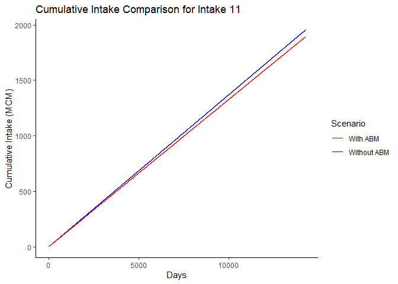<!-- -->

``` r
## Agr 12 recipient
cumline <- data.frame(days = 1:c(39*365), cumsum_withoutABM= cumsum(without_ABM_new_diversion$df_agr[,13]),cumsum_withABM= cumsum(with_ABM_new_diversion$df_agr[,13]))
ggplot(data = cumline, aes(x = days)) +
  geom_line(aes(y = cumsum_withoutABM, color = "Without ABM")) +
  geom_line(aes(y = cumsum_withABM, color = "With ABM")) +
  scale_color_manual(
    values = c("Without ABM" = "blue", "With ABM" = "red"),
    name = "Scenario"  # 범례 제목
  ) +
  labs(
    title = "Cumulative Intake Comparison for Agr 13",
    x = "Days",
    y = "Cumulative Intake (MCM)"
  ) +
  theme_classic()
```

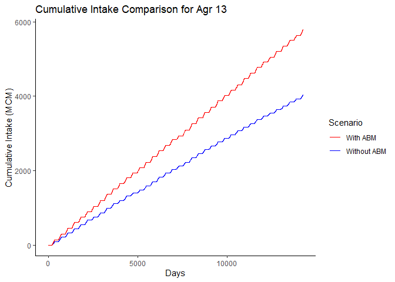<!-- -->

``` r
# Agr 7
cumline <- data.frame(days = 1:c(39*365), cumsum_withoutABM= cumsum(without_ABM_new_diversion$df_agr[,7]),cumsum_withABM= cumsum(with_ABM_new_diversion$df_agr[,7]))
ggplot(data = cumline, aes(x = days)) +
  geom_line(aes(y = cumsum_withoutABM, color = "Without ABM")) +
  geom_line(aes(y = cumsum_withABM, color = "With ABM")) +
  scale_color_manual(
    values = c("Without ABM" = "blue", "With ABM" = "red"),
    name = "Scenario"  # 범례 제목
  ) +
  labs(
    title = "Cumulative Intake Comparison for Agr 7",
    x = "Days",
    y = "Cumulative Intake (MCM)"
  ) +
  theme_classic()
```

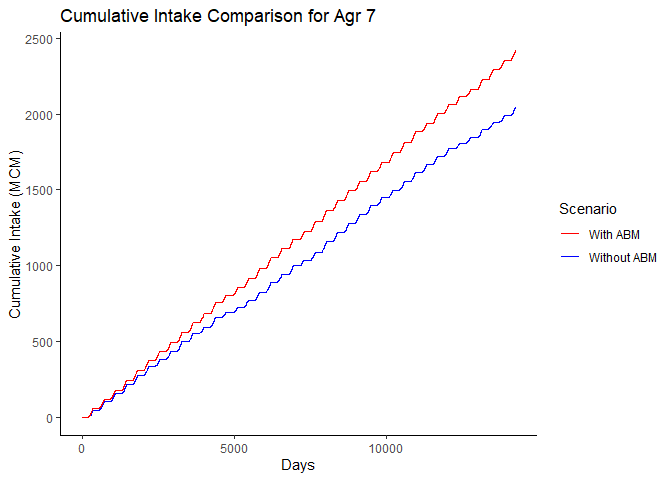<!-- -->

``` r
# Agr 10
cumline <- data.frame(days = 1:c(39*365), cumsum_withoutABM= cumsum(without_ABM_new_diversion$df_agr[,11]),cumsum_withABM= cumsum(with_ABM_new_diversion$df_agr[,11]))
ggplot(data = cumline, aes(x = days)) +
  geom_line(aes(y = cumsum_withoutABM, color = "Without ABM")) +
  geom_line(aes(y = cumsum_withABM, color = "With ABM")) +
  scale_color_manual(
    values = c("Without ABM" = "blue", "With ABM" = "red"),
    name = "Scenario"  # 범례 제목
  ) +
  labs(
    title = "Cumulative Intake Comparison for Agr 11",
    x = "Days",
    y = "Cumulative Intake (MCM)"
  ) +
  theme_classic()
```

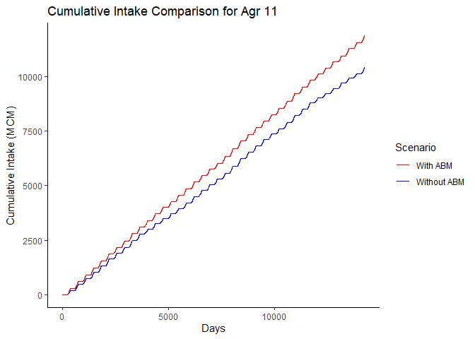<!-- -->

``` r
## donor
cumline <- data.frame(days = 1:c(39*365), cumsum_withoutABM= cumsum(without_ABM_new_diversion$df_agr[,13]),cumsum_withABM= cumsum(with_ABM_new_diversion$df_agr[,13]))
ggplot(data = cumline, aes(x = days)) +
  geom_line(aes(y = cumsum_withoutABM, color = "Without ABM")) +
  geom_line(aes(y = cumsum_withABM, color = "With ABM")) +
  scale_color_manual(
    values = c("Without ABM" = "blue", "With ABM" = "red"),
    name = "Scenario"  # 범례 제목
  ) +
  labs(
    title = "Cumulative Intake Comparison for Agr 13",
    x = "Days",
    y = "Cumulative Intake (MCM)"
  ) +
  theme_classic()
```

<!-- -->

## donors

``` r
cumline <- data.frame(days = 1:c(39*365), cumsum_withoutABM= cumsum(without_ABM_new_diversion$df_intake[,4]),cumsum_withABM= cumsum(with_ABM_new_diversion$df_intake[,4]))
ggplot(data = cumline, aes(x = days)) +
  geom_line(aes(y = cumsum_withoutABM, color = "Without ABM")) +
  geom_line(aes(y = cumsum_withABM, color = "With ABM")) +
  scale_color_manual(
    values = c("Without ABM" = "blue", "With ABM" = "red"),
    name = "Scenario"  # 범례 제목
  ) +
  labs(
    title = "Cumulative Intake Comparison for Intake 4",
    x = "Days",
    y = "Cumulative Intake (MCM)"
  ) +
  theme_classic()
```

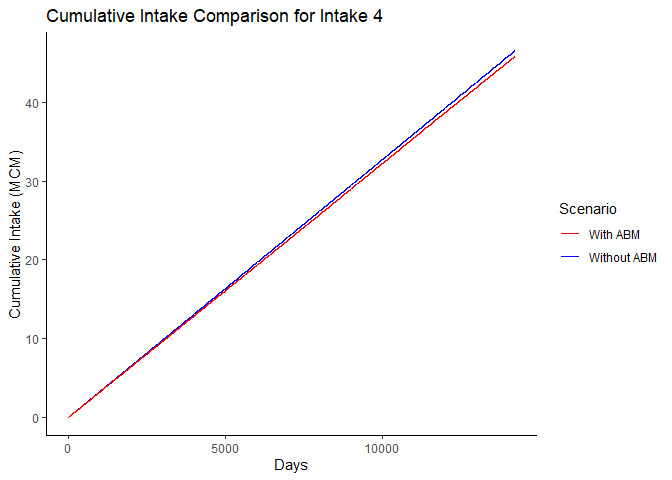<!-- -->

``` r
cumline <- data.frame(days = 1:c(39*365), cumsum_withoutABM= cumsum(without_ABM_new_diversion$df_agr[,12]),cumsum_withABM= cumsum(with_ABM_new_diversion$df_agr[,12]))
ggplot(data = cumline, aes(x = days)) +
  geom_line(aes(y = cumsum_withoutABM, color = "Without ABM")) +
  geom_line(aes(y = cumsum_withABM, color = "With ABM")) +
  scale_color_manual(
    values = c("Without ABM" = "blue", "With ABM" = "red"),
    name = "Scenario"  # 범례 제목
  ) +
  labs(
    title = "Cumulative Intake Comparison for Agr 12",
    x = "Days",
    y = "Cumulative Intake (MCM)"
  ) +
  theme_classic()
```

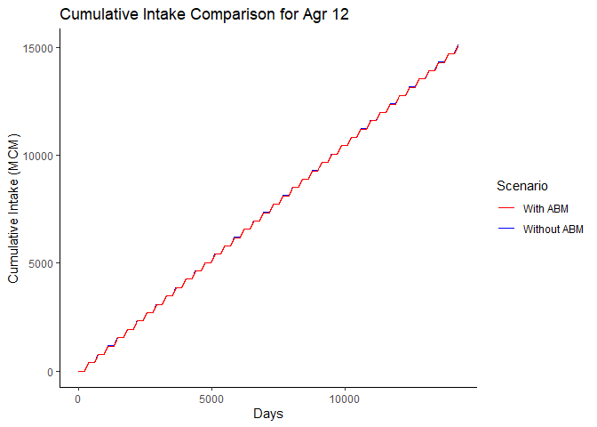<!-- -->

``` r
cumline <- data.frame(days = 1:c(39*365), cumsum_withoutABM= cumsum(without_ABM_new_diversion$df_intake[,11]),cumsum_withABM= cumsum(with_ABM_new_diversion$df_intake[,11]))
ggplot(data = cumline, aes(x = days)) +
  geom_line(aes(y = cumsum_withoutABM, color = "Without ABM")) +
  geom_line(aes(y = cumsum_withABM, color = "With ABM")) +
  scale_color_manual(
    values = c("Without ABM" = "blue", "With ABM" = "red"),
    name = "Scenario"  # 범례 제목
  ) +
  labs(
    title = "Cumulative Intake Comparison for Intake 11",
    x = "Days",
    y = "Cumulative Intake (MCM)"
  ) +
  theme_classic()
```

<!-- -->

``` r
## donor
cumline <- data.frame(days = 1:c(39*365), cumsum_withoutABM= cumsum(without_ABM_new_diversion$df_agr[,14]),cumsum_withABM= cumsum(with_ABM_new_diversion$df_agr[,14]))
ggplot(data = cumline, aes(x = days)) +
  geom_line(aes(y = cumsum_withoutABM, color = "Without ABM")) +
  geom_line(aes(y = cumsum_withABM, color = "With ABM")) +
  scale_color_manual(
    values = c("Without ABM" = "blue", "With ABM" = "red"),
    name = "Scenario"  # 범례 제목
  ) +
  labs(
    title = "Cumulative Intake Comparison for Agr 14",
    x = "Days",
    y = "Cumulative Intake (MCM)"
  ) +
  theme_classic()
```

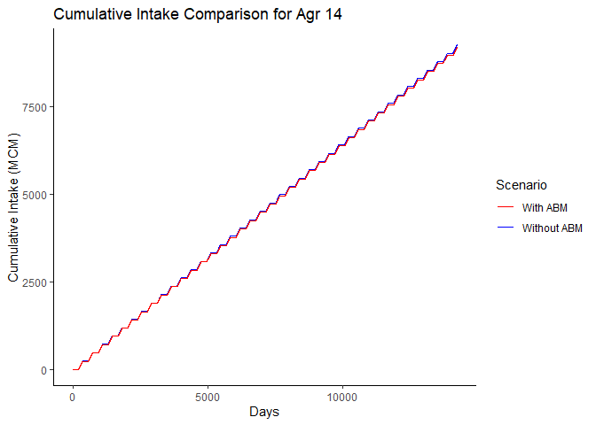<!-- -->

``` r
cumline <- data.frame(days = 1:c(39*365), cumsum_withoutABM= cumsum(without_ABM_new_diversion$df_intake[,6]),cumsum_withABM= cumsum(with_ABM_new_diversion$df_intake[,6]))
ggplot(data = cumline, aes(x = days)) +
  geom_line(aes(y = cumsum_withoutABM, color = "Without ABM")) +
  geom_line(aes(y = cumsum_withABM, color = "With ABM")) +
  scale_color_manual(
    values = c("Without ABM" = "blue", "With ABM" = "red"),
    name = "Scenario"  # 범례 제목
  ) +
  labs(
    title = "Cumulative Intake Comparison for Intake 6",
    x = "Days",
    y = "Cumulative Intake (MCM)"
  ) +
  theme_classic()
```

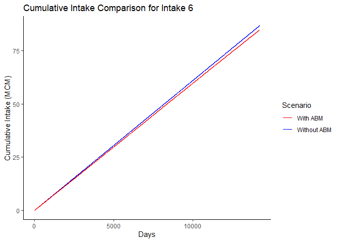<!-- -->

``` r
df_ratio <- as.data.frame(without_ABM_new_diversion$df_agr / without_ABM_new_diversion$demand_agr)
colnames(df_ratio) <- paste0("Agr", seq_len(ncol(df_ratio)))

start_date <- as.Date("1981-10-01")
df_ratio <- df_ratio %>%
  mutate(Date = seq(start_date, by = "day", length.out = nrow(df_ratio))) %>%
  relocate(Date)

df_2018_to_2020 <- df_ratio %>%
  filter(Date >= as.Date("2018-01-01"),
         Date <= as.Date("2020-12-31"))

mat <- as.matrix(select(df_2018_to_2020, -Date))
mat[!is.finite(mat)] <- NA  # Inf, -Inf, NaN -> NA

colSums(mat, na.rm = TRUE)
```

    ##     Agr1     Agr2     Agr3     Agr4     Agr5     Agr6     Agr7     Agr8 
    ## 459.0000 459.0000 459.0000 459.0000 340.7681 459.0000 294.6407 459.0000 
    ##     Agr9    Agr10    Agr11    Agr12    Agr13    Agr14 
    ## 349.3071 459.0000 289.0437 459.0000 214.0913 458.9495
